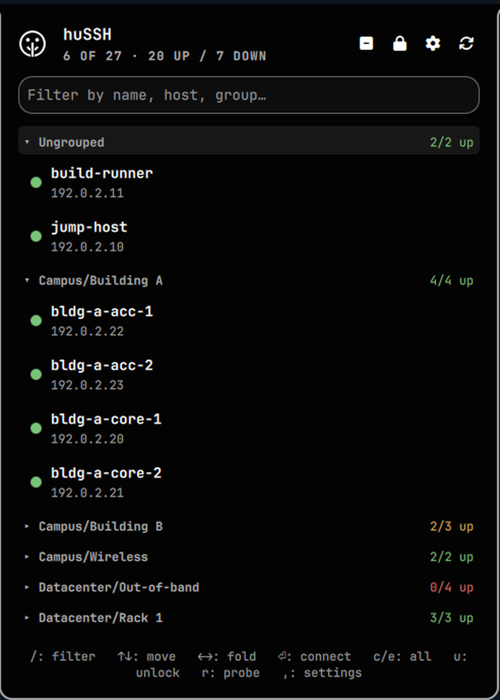

# huSSH

A compact SSH client that lives in the Omarchy bar. One icon, one dropdown:
your sessions grouped exactly as your old client had them, a reachability dot
per host, and Enter to connect in your default terminal.

<p align="center">
  
</p>

Built for network engineers with a few hundred devices behind TACACS+ or
RADIUS, where every box wants the same password and key auth isn't an option.

## Why

Existing options are a GUI app you alt-tab to, or a wall of shell aliases.
This is neither: the session list is one click from wherever you already are,
it shows you what's reachable before you try, and it does not store your
password.

## Features

- **Session import** from SecureCRT, PuTTY, generic JSON, or XML
  (mRemoteNG-style). Folder hierarchy is preserved exactly as exported.
- **Live reachability** — background TCP sweep of each host's port. Dots use
  shape *and* colour (filled = up, hollow ring = down, faint ring = unprobed)
  so they stay readable without colour vision.
- **Collapsible groups** with per-group tallies, so a folded
  `Site A / Console  0/12 up` tells you the console server is dead at a glance.
- **Credential caching in RAM only** — your password goes into the kernel user
  keyring with an expiry, never to disk, never into a command line.
- **Keyboard driven** — filter, navigate, fold, and connect without the mouse.
- **Theme aware** — follows your Omarchy theme and fillet settings, including
  the drawn bar icon.

## Install

```bash
omarchy plugin clone https://github.com/Wizard-NetEng/huSSH
```

Then add the **huSSH** widget to a bar section in Omarchy's bar settings.

The credential cache uses `keyctl` from `keyutils`. It is already present on
essentially every Arch desktop (`krb5` depends on it), so there is usually
nothing to install. To confirm:

```bash
command -v keyctl || echo "install keyutils with your package manager"
```

## Uninstall

Remove the widget from your bar section, then:

```bash
omarchy plugin remove io.github.wizard-neteng.hussh
```

That deletes the plugin. Your imported sessions and settings live separately
and are left alone, so reinstalling picks up where you left off. To remove
those too:

```bash
rm -rf ~/.config/omarchy/hussh     # sessions, settings, collapsed-group state
hussh-cred lock                    # drop any cached credential immediately
```

huSSH writes nothing outside `~/.config/omarchy/hussh/` and the plugin
directory, and never edits your shell, SSH, or terminal configuration.

## Importing sessions

Open the settings gear in the popup (or press `,`), enter a path, and choose
**Replace** or **Merge**. Formats are detected by extension.

From the command line:

```bash
bin/hussh-import ~/sessions.json                     # generic JSON
bin/hussh-import ~/confCons.xml                      # mRemoteNG XML
bin/hussh-import ~/.vandyke/SecureCRT/Config/Sessions   # SecureCRT
bin/hussh-import ~/putty-export.reg                  # PuTTY
bin/hussh-import ~/more.xml --merge                  # add to existing
```

### JSON format

A bare list, or `{"sessions": [...]}`. Field names are matched leniently —
`host`/`hostname`/`address`/`ip`, `user`/`username`/`login`, and so on.

```json
[
  { "name": "edge-1", "host": "192.0.2.10", "user": "netops", "port": 22 },
  { "name": "console", "host": "192.0.2.12", "port": 2001, "protocol": "telnet" }
]
```

Nested folders keep their hierarchy:

```json
{
  "sessions": [
    { "name": "Site A", "children": [
      { "name": "sw-a1", "host": "198.51.100.1" }
    ]}
  ]
}
```

**Passwords are never imported**, including from SecureCRT files that contain
them. That is deliberate.

## How credentials work

Password auth on centrally-managed gear is the awkward case: you cannot use
keys, and you do not want the password on disk or in `ps` output.

huSSH caches it in the **kernel user keyring** (`@u`) with `keyctl timeout`, so
it expires on its own and is readable only by your own processes. `ssh` picks
it up through `SSH_ASKPASS`, which means it never appears in a command line and
never touches the filesystem.

Connecting to a host you have not seen before happens in two phases:

1. Without `SSH_ASKPASS_REQUIRE=force`, so the host-key fingerprint prompt
   reaches your terminal and **you** decide whether to accept it.
2. With `force`, so the cached credential is supplied silently.

The result: one `yes` per new device, one password per unlock window, and no
credential ever written down. Fingerprints are never auto-accepted.

Lock it early with the lock icon, `u`, or:

```bash
bin/hussh-cred lock
```

## Keyboard

| Key       | Action                          |
|-----------|---------------------------------|
| `/`       | filter                          |
| `↑` `↓`   | move                            |
| `←` `→`   | fold / unfold group             |
| `⏎`       | connect                         |
| `c` / `e` | collapse / expand all           |
| `u`       | unlock or lock the credential   |
| `r`       | re-probe all hosts              |
| `,`       | settings                        |

## Settings

Widget settings (bar settings UI): probe interval, probe timeout, credential
hold time, hide unreachable hosts.

In-popup settings (the gear): default username, password caching, and session
import.

Files, all under `~/.config/omarchy/hussh/`:

| File            | Contents                                  |
|-----------------|-------------------------------------------|
| `sessions.json` | your imported sessions                    |
| `settings.json` | username and unlock window — **no secrets** |
| `ui-state.json` | which groups are collapsed                |

## Security notes

- The password is held **only** in the kernel keyring, with an expiry. It is
  never written to any file and never passed as a command-line argument.
- Host key fingerprints are shown to you for approval. huSSH never sets
  `StrictHostKeyChecking=no`.
- Imported session files are scrubbed of control characters before display.
- Saved passwords in SecureCRT exports are ignored, not migrated.

Plugins run unsandboxed in Omarchy. Read the source before installing this or
anything else — it is about 1,500 lines and deliberately readable.

## Requirements

- Omarchy 4.x with the Quickshell bar
- OpenSSH client
- `keyutils` (`keyctl`)
- Python 3 (importer and prober)

## License

MIT — see [LICENSE](LICENSE).
